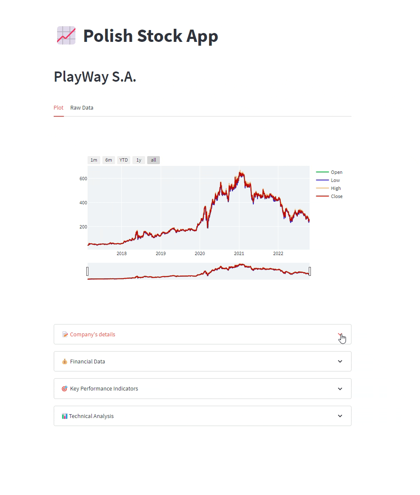
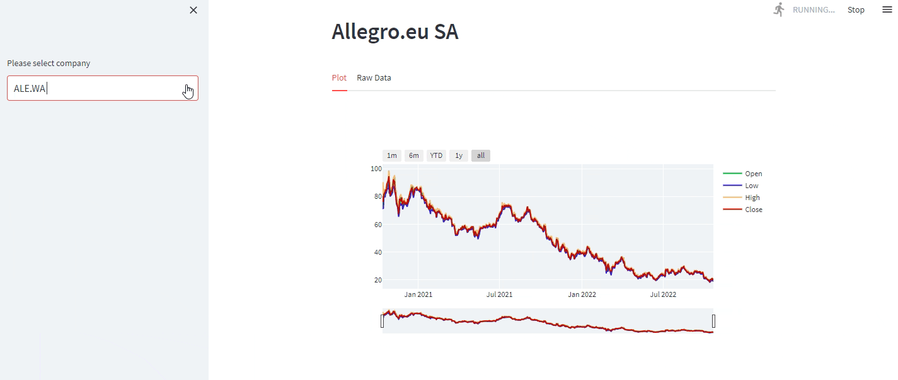

# Polish Stock Market Engine

I created a website for analysis of companies on the **Polish Stock Market**. The target audience should easily navigate the website analyzing the parameters they choose.

#### Project Status: [Active]

## Application Link
To access the application, please click on this link: [Polish Stock Market Engine](https://dominikdawiec-polish-stock-market-engine-app-ome691.streamlit.app/)

## Project Objective

### Methods Used
* Data Downloading with API
* Data Cleaning
* Data Visualization

### Technologies
* Python
* Streamlit
* Numpy, Pandas
* Yfinance 
* Plotly

### Project Building Steps
* defining the available options on the website
* building the website
* deployment of the website on Streamlit

## Getting Started
1. You may see the result through this [link](https://dominikdawiec-polish-stock-market-engine-app-ome691.streamlit.app/) 
2. you can see the code in app.py

## Contact
* Please feel free to reach me through my [LinkedIn](http://linkedin.com/in/dominikdawiec/).  
